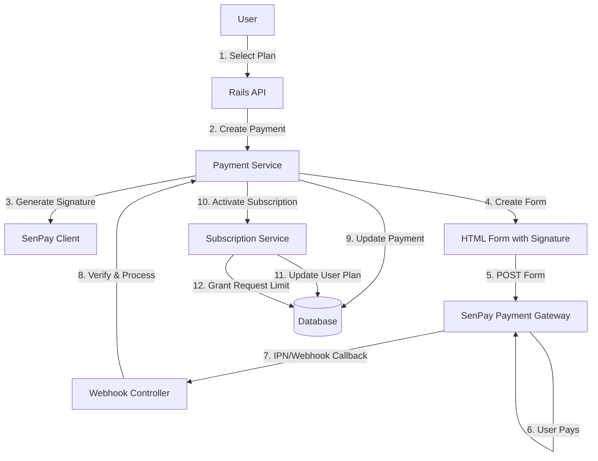

# System Design & Architecture

## Architecture Overview
**What is the high-level system structure?**



**Key components and their responsibilities:**
- **SenPay Client**: Wrapper cho SenPay API, xử lý signature generation, form creation, Basic Authentication
- **Payment Service**: Business logic cho payment flow, payment creation, status update
- **Subscription Service**: Business logic cho subscription activation, request limit management
- **Webhook Controller**: Nhận và verify IPN/Webhook từ SenPay
- **Payment Controller**: API endpoints cho payment creation và status check

**Technology stack choices and rationale:**
- **Rails 8.0.2**: Framework chính, API-only mode
- **Supabase PostgreSQL**: Database cho payments và subscription data
- **HTTP Client**: Sử dụng `Net::HTTP` cho SenPay API calls
- **JSON Webhook**: Xử lý JSON payload từ SenPay webhook
- **Basic Authentication**: SenPay sử dụng Basic Auth (merchant_id:secret_key)

## Data Models
**What data do we need to manage?**

### Payment Model (Existing - Enhanced)
```ruby
# app/models/payment.rb
class Payment < ApplicationRecord
  belongs_to :user
  belongs_to :subscription_plan

  # Status: pending, success, failed, cancelled, expired
  # payment_method: 'senpay'
  # transaction_data: JSONB chứa SenPay response data
  #
  # Cấu trúc khi tạo payment (Payment Creation):
  #   {
  #     "form_data": {
  #       "merchant": "YOUR_MERCHANT_ID",
  #       "order_amount": 100000,
  #       "order_invoice_number": "123",
  #       "order_description": "Subscription: Pro Plan",
  #       "return_url": "https://your-domain.com/payment/return",
  #       "ipn_url": "https://your-domain.com/api/webhooks/senpay",
  #       "signature": "GENERATED_SIGNATURE"
  #     },
  #     "checkout_url": "https://pay-sandbox.sepay.vn/v1/checkout/init"
  #   }
  #
  # Cấu trúc khi nhận webhook (Webhook Callback):
  #   {
  #     "notification_type": "ORDER_PAID",
  #     "order": {
  #       "order_invoice_number": "123",
  #       "order_amount": 100000,
  #       "order_status": "CAPTURED"
  #     },
  #     "transaction": {
  #       "id": "transaction_id_123",
  #       "gateway": "Vietcombank",
  #       "transaction_date": "2025-11-07T10:00:00Z",
  #       "amount_in": 100000,
  #       "amount_out": 0,
  #       "accumulated": 1000000,
  #       "code": "ORDER123",
  #       "reference_number": "REF123",
  #       "transaction_content": "Thanh toan don hang ORDER123",
  #       "account_number": "1234567890",
  #       "sub_account": null
  #     },
  #     "form_data": { ... },  # Giữ lại form_data từ payment creation
  #     "checkout_url": "..."  # Giữ lại checkout_url từ payment creation
  #   }
end
```

### Subscription Plan Model (Existing)
```ruby
# app/models/subscription_plan.rb
class SubscriptionPlan < ApplicationRecord
  # features: JSONB
  #   {
  #     "ai_limit": 100,
  #     "crawl_limit": 50
  #   }
end
```

### User Model (Existing - Enhanced)
```ruby
# app/models/user.rb
class User < ApplicationRecord
  belongs_to :subscription_plan, optional: true
  has_many :payments, dependent: :destroy
  
  # Cần thêm methods:
  # - current_ai_request_limit: Lấy giới hạn từ subscription_plan.features
  # - remaining_ai_requests: Tính số request còn lại
  # - can_use_ai_chatbox?: Check xem còn request không
end
```

### New Models (Optional - for Webhook Transaction Logging)
```ruby
# app/models/senpay_transaction.rb (Optional)
# Có thể dùng payments.transaction_data thay vì tạo model riêng
# Hoặc tạo migration để thêm fields vào payments table
```

**Data flow between components:**
1. User → Payment creation → `payments` table (status: pending)
2. SenPay IPN callback → Payment update → `payments` table (status: success/failed, transaction_data)
3. Payment success → Subscription activation → `users.subscription_plan_id` update
4. Subscription activation → Request limit grant → Stored in `users` hoặc separate tracking table

## API Design
**How do components communicate?**

### External APIs (SenPay Payment Gateway)

**SenPay Checkout API (Sandbox Environment)**
- **Endpoint**: `https://pay-sandbox.sepay.vn/v1/checkout/init`
- **Method**: POST (HTML Form)
- **Headers**: 
  - `Content-Type: application/x-www-form-urlencoded`
- **Request Body** (Form Data):
  ```
  merchant=YOUR_MERCHANT_ID
  order_amount=100000
  order_invoice_number=ORDER123
  order_description=Subscription: Pro Plan
  return_url=https://your-domain.com/payment/return
  ipn_url=https://your-domain.com/api/webhooks/senpay
  signature=GENERATED_SIGNATURE
  ```
- **Response**: HTML redirect to SenPay payment page (không phải JSON)

**SenPay IPN/Webhook Callback**
- **Endpoint**: `POST /api/webhooks/senpay` (trên server của bạn)
- **Method**: POST
- **Headers**: 
  - `Content-Type: application/json`
- **Request Body**:
  ```json
  {
    "notification_type": "ORDER_PAID",
    "order": {
      "order_invoice_number": "ORDER123",
      "order_amount": 100000,
      "order_status": "CAPTURED"
    },
    "transaction": {
      "id": "...",
      "gateway": "...",
      "transaction_date": "...",
      "amount_in": 100000,
      "code": "...",
      "reference_number": "..."
    }
  }
  ```
- **Response**: HTTP 200 với `{"success": true}`

**SenPay Query API (Đối soát)**
- **Base URL**: `https://pgapi-sandbox.sepay.vn`
- **Endpoint**: `GET /v1/order/detail/{order_id}`
- **Method**: GET
- **Headers**: 
  - `Authorization: Basic base64(merchant_id:secret_key)`
  - `Content-Type: application/json`
- **Response**:
  ```json
  {
    "data": {
      "order_invoice_number": "ORDER123",
      "order_amount": 100000,
      "order_status": "CAPTURED",
      "transaction_id": "..."
    }
  }
  ```

### Internal APIs

**Create Payment Request**
- **Endpoint**: `POST /api/payments`
- **Method**: POST
- **Authentication**: Required (user token)
- **Request Body**:
  ```json
  {
    "subscription_plan_id": 1,
    "payment_method": "senpay"
  }
  ```
- **Response** (Success):
  ```json
  {
    "data": {
      "id": 123,
      "status": "pending",
      "amount": 100000,
      "checkout_url": "https://pay-sandbox.sepay.vn/v1/checkout/init",
      "form_data": {
        "merchant": "...",
        "order_amount": 100000,
        "order_invoice_number": "123",
        "signature": "..."
      },
      "expires_at": "2025-11-07T00:15:00Z"
    }
  }
  ```

**Get Payment Status**
- **Endpoint**: `GET /api/payments/:id`
- **Method**: GET
- **Authentication**: Required (user token)
- **Response**:
  ```json
  {
    "data": {
      "id": 123,
      "status": "success",
      "amount": 100000,
      "subscription_plan": {
        "id": 1,
        "name": "Pro Plan",
        "features": {
          "ai_limit": 100
        }
      },
      "created_at": "2025-11-06T17:00:00Z"
    }
  }
  ```

**Authentication/authorization approach:**
- Sử dụng existing authentication mechanism (từ `Authenticatable` concern)
- User chỉ có thể xem payments của chính mình
- Webhook endpoint cần verify signature từ SenPay (không dùng user auth)

## Component Breakdown
**What are the major building blocks?**

### Backend Services/Modules

**1. SenPay Client Service** (`app/services/senpay/client.rb`)
- Responsibilities:
  - Tạo payment request với SenPay API
  - Generate signature cho requests (HMAC SHA256 + Base64)
  - Verify signature từ webhook
  - Parse SenPay API responses
  - Basic Authentication (merchant_id:secret_key)
- Methods:
  - `create_payment_request(params)` → Returns form data with signature
  - `verify_webhook_signature(params, signature)` → Returns boolean
  - `build_signature(params)` → Returns signature string (Base64 encoded)
  - `query_order_status(order_id)` → Returns order status

**2. Payment Service** (`app/services/payments/create_payment_service.rb`)
- Responsibilities:
  - Tạo payment record
  - Gọi SenPay Client để tạo payment request
  - Generate HTML form với signature
  - Return checkout URL hoặc form data
- Methods:
  - `call(user:, subscription_plan:, payment_method:)` → Returns payment object with checkout form

**3. Payment Webhook Service** (`app/services/payments/process_webhook_service.rb`)
- Responsibilities:
  - Verify webhook signature
  - Update payment status
  - Trigger subscription activation nếu payment success
  - Idempotent processing (check duplicate)
- Methods:
  - `call(webhook_params)` → Returns success/failure

**4. Subscription Activation Service** (`app/services/subscriptions/activate_service.rb`)
- Responsibilities:
  - Activate subscription plan cho user
  - Grant request limit từ plan features
  - Set expired_at date
- Methods:
  - `call(user:, subscription_plan:, payment:)` → Returns activated subscription

**5. Request Limit Service** (`app/services/subscriptions/request_limit_service.rb`)
- Responsibilities:
  - Track AI request usage
  - Check remaining requests
  - Decrement request count khi user dùng AI chatbox
- Methods:
  - `remaining_requests(user)` → Returns integer
  - `can_use_ai_chatbox?(user)` → Returns boolean
  - `consume_request(user)` → Decrements count

### Controllers

**1. Payments Controller** (`app/controllers/payments_controller.rb`)
- Actions:
  - `create` - Tạo payment request
  - `show` - Xem payment status
  - `index` - List user payments

**2. Webhook Controller** (`app/controllers/webhooks/senpay_controller.rb`)
- Actions:
  - `callback` - Nhận IPN/Webhook từ SenPay

### Database/storage layer
- **payments** table: Lưu payment records và transaction_data (JSONB)
- **users** table: Lưu subscription_plan_id và có thể thêm request tracking
- **subscription_plans** table: Lưu plan features với ai_limit

### Third-party integrations
- **SenPay Payment Gateway**: Sandbox environment integration
- **Webhook endpoint**: Phải accessible từ internet (ngrok hoặc staging server)

## Design Decisions
**Why did we choose this approach?**

### 1. Service Layer Pattern
- **Decision**: Tách business logic vào Services thay vì đặt trong Controllers
- **Rationale**: 
  - Tuân thủ project structure (Controllers mỏng, Services xử lý business logic)
  - Dễ test và maintain
  - Có thể reuse services ở nhiều nơi

### 2. JSONB cho Transaction Data
- **Decision**: Lưu SenPay response vào `payments.transaction_data` (JSONB)
- **Rationale**:
  - Flexible, không cần migration khi SenPay thay đổi response structure
  - Dễ query và filter
  - Đã có sẵn trong schema

### 3. Webhook Signature Verification
- **Decision**: Verify signature từ SenPay webhook trước khi xử lý
- **Rationale**:
  - Security: Đảm bảo webhook thực sự từ SenPay
  - Prevent fraud: Tránh fake webhook requests

### 4. HTML Form Approach
- **Decision**: Tạo HTML form với signature và POST đến SenPay
- **Rationale**:
  - SenPay yêu cầu POST form thay vì JSON API
  - Form approach phù hợp với SenPay checkout flow
  - Frontend có thể submit form hoặc redirect

### 5. Idempotent Webhook Processing
- **Decision**: Check duplicate transactions trước khi xử lý
- **Rationale**:
  - SenPay có retry mechanism → có thể gửi duplicate webhooks
  - Tránh xử lý một transaction nhiều lần
  - Đảm bảo data consistency

### Alternatives considered
- **Option 1**: Tích hợp trực tiếp trong Controller
  - **Rejected**: Không tuân thủ project structure, khó test
- **Option 2**: Tạo separate model cho SenPay transactions
  - **Rejected**: Over-engineering, có thể dùng JSONB trong payments
- **Option 3**: Synchronous payment status check (polling)
  - **Rejected**: Inefficient, webhook approach tốt hơn

### Patterns and principles applied
- **Service Object Pattern**: Business logic trong services
- **Repository Pattern**: Database access qua ActiveRecord models
- **Strategy Pattern**: Có thể mở rộng cho payment methods khác
- **Idempotency**: Webhook processing phải idempotent (xử lý duplicate webhooks)

## Non-Functional Requirements
**How should the system perform?**

### Performance targets
- Payment creation API: < 500ms response time
- Webhook processing: < 2 seconds
- Database queries: Optimized, no N+1 queries
- SenPay API call: < 1 second (network dependent)

### Scalability considerations
- Webhook endpoint phải handle concurrent requests
- Payment status check có thể cache để giảm DB load
- Background job cho webhook processing (nếu cần retry)

### Security requirements
- Webhook signature verification (bắt buộc)
- Payment data encryption trong transit (HTTPS)
- Sensitive data (SenPay credentials) lưu trong environment variables
- User chỉ có thể xem payments của chính mình
- Rate limiting cho webhook endpoint (tránh abuse)
- Basic Authentication cho SenPay API calls

### Reliability/availability needs
- Webhook endpoint phải available 24/7
- Idempotent webhook processing (xử lý duplicate webhooks)
- Error handling và logging cho debugging
- Retry mechanism cho failed webhook processing (optional, có thể làm sau)
